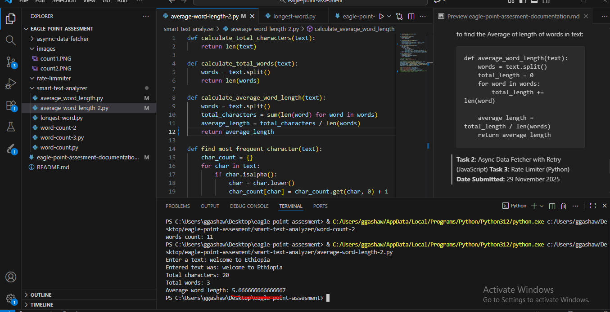
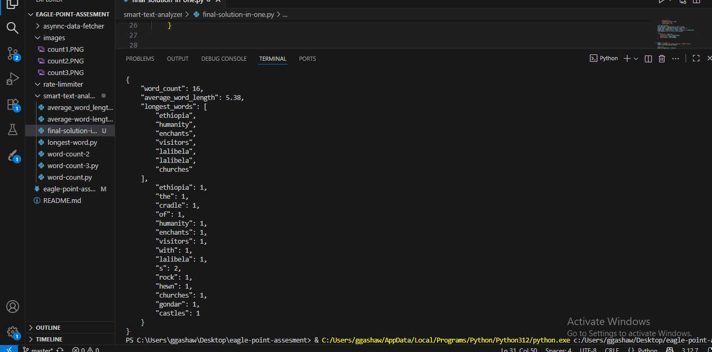

# Eagle point Assesment Documentations
**Name:** Gashaw Gedef
## TASK 1: Smart Text Analyzer

### 1. Searches Performed (exact queries + URLs)


**Query:** "Write a `python` fumction to count words in text"
### URLs and Solutions
https://www.geeksforgeeks.org/python/python-program-to-count-words-in-text-file/
https://stackoverflow.com/questions/19410018/how-to-count-the-number-of-words-in-a-sentence-ignoring-numbers-punctuation-an
https://thegeekycodes.com/building-a-python-word-counter-and-analyzer/
https://code.tutsplus.com/counting-word-frequency-in-a-file-using-python--cms-25965t
https://www.kaggle.com/code/saidrahmatpanah/lab3-6-text-analysis
https://advertools.readthedocs.io/en/master/advertools.word_frequency.html

- 1 use `split()`

```
c=0
with open(r'C:\Users\ggashaw\Desktop\sample_file.txt','r') as file:
    data= file.read()
    lines =data.split()
    for word in lines:
        if not word.isnumeric():
            c+=1

print(c)
```
input text

```
welcome, to ethiopia as todat good as goof df gh jk ?
```
**output:**


from the result we can understand that panctuation is counted as a word when we use `split()` method.

- 2 use Regular Exprestion to get Word Count
```

import collections
import re
from collections import Counter


def count_words(text):
    words = re.findall(r'\w+',text.lower())
    return words

"Analyzing word frequency"
def analyze_word_frequency(words):
    word_count=collections.Counter(words)
    return word_count


def main():
    filename =  r"C:\Users\ggashaw\Desktop\sample_file.txt"
    try:
        with open(filename, "r", encoding="utf-8") as file:
            text = file.read()
            words = count_words(text)
            print("words count:",len(words))
    except FileNotFoundError:
        print(f"Error: File '{filename}' not found.")
    except Exception as e:
        print(f"Error: {str(e)}")
if __name__ == "__main__":
    main()
```
***Output:**


The above reregular expression  excludes `panctuations` to be counted as a word and the number of words in a text is `11`. it solves the problem identified when using `split()` method. 

**Query:** "Write a `python` fumction to find  average Word Length in text"
### URLs and Solutions
https://stackoverflow.com/questions/28333732/how-to-calculate-average-word-sentence-length-in-python-2-7-from-a-text-file
https://medium.com/data-and-beyond/build-python-project-a-text-analyzer-tool-686c9647a54c
https://www.daniweb.com/programming/software-development/threads/194704/average-word-count-in-a-text
https://www.kaggle.com/code/iamrahulthorat/assignment-6-sample-solution
https://www.geeksforgeeks.org/python/python-average-string-length-in-list/
https://www.digitalocean.com/community/tutorials/average-of-list-in-python
https://www.geeksforgeeks.org/python/python-average-string-length-in-list/

to find the Average of length of words in text:

```
def average_word_length(text):
    words = text.split()
    total_length = 0
    for word in words:
        total_length += len(word)

    average_length = total_length / len(words)
    return average_length
```
***Output:**

From above code the result is `5.66666666667` not in 2 decimal places. 

**Query:** "Write a `python` fumction to find  the longest word in Text or list "
### URLs and Solutions

https://stackoverflow.com/questions/16365807/finding-the-longest-words-in-a-text-file
https://www.geeksforgeeks.org/python/python-program-to-find-the-longest-word-in-a-sentence/
https://systechgroup.in/blog-python-program-to-find-the-longest-word/
https://www.geeksforgeeks.org/dsa/find-the-length-of-the-longest-possible-word-chain/

- sample code 

```
def longest_word_in_sentence(sentence):
    words = sentence.split()
    longest = max(words, key=len, default="")
    return longest

sentence = input("Enter a sentence: ")
result = longest_word_in_sentence(sentence)
print(f"The longest word is: {result}")

def longest_word_in_list(word_list):
    longest = max(word_list, key=len, default="")
    return longest

words = ["apple", "banana", "cherry", "Telecommunications"]
result = longest_word_in_list(words)
print(f"The longest word is: {result}")


import re

def longest_word_advanced(sentence):
    words = re.findall(r'\b\w+\b', sentence.lower())
    return max(words, key=len, default="")

```

**Query:** "Write a `python` fumction to find  word frequency in text or list "
### URLs and Solutions

https://thegeekycodes.com/building-a-python-word-counter-and-analyzer/
https://stackoverflow.com/questions/35857519/efficiently-count-word-frequencies-in-python
https://www.geeksforgeeks.org/python/find-frequency-of-each-word-in-a-string-in-python/


```
def analyze_word_frequency(words):
    # Count word occurrences
    word_count = collections.Counter(words)
    return word_count
```
we analyze the `frequency` of each word using the collections.Counter function.


### 2. Final Solution for Task 1
### Thought Process & Decisions 
- First  used the method  `text.split()`  and  fails on punctuation ("?" counted as a word)
- when using above `text.split()` method, it requires many for loops which may lead to errors and difficult to read
- Used regular pattern  `re.findall(r'\w+', text.lower())` to extract clean words
- Used `collections.Counter` standard library  to get the frequency of word easily.
- to get  Average length: simple sum of lengths divided by count, round to 2 decimal place is required

**Why You choose this approach?**
- I considered Time and Space complexity to O(n)
- The this ext solution should handle panctuations 
- The code should be easily readable and maintainable

**Steps to Implement Task One**

1. Use regex to extract words in text   like `re.findall(r'\w+', text.lower())`
2. count the length of words in text using the method   `len(words)`
3. Calculate total characters a word contains in a text 
4. Find average word length and round to 2 decimal places
5. Find The longest word in list of words
6. count frequency of word in text
7. Wrappe  everything in one function and return in the required format

```

import collections
import re

def smart_text_analyzer(text):
    words = re.findall(r'\w+',text.lower())
    if not words:
        return {
            "word_count": 0,
            "average_word_length": 0.00,
            "longest_words": [],
            "word_frequency": {}
        }
    word_count=len(words)
    total_characters = sum(len(word) for word in words)
    average_length = round(total_characters / word_count, 2)
    longest_word = max(len(word) for word in words)
    longest_words = [word for word in words if len(word) == longest_word]
    word_frequency =dict(collections.Counter(words))
    
    return  {
        "word_count": word_count,
        "average_word_length": average_length,
        "longest_words": longest_words,
        "word_frequency": word_frequency
    }


if __name__ == "__main__":
    example = "Ethiopia, the cradle of humanity, enchants visitors with Lalibela’s rock-hewn churches, Gondar’s castles."
    result = smart_text_analyzer(example)
    
    import json
    print(json.dumps(result, indent=4))
```
**Output:**


## Task 2: Async Data Fetcher with Retry (JavaScript) 
### 1. Searches Performed (exact queries + URLs)

**Query:** "Write a `javascript` function performing  Async Data Fetcher with Retry

https://dev.to/ycmjason/javascript-fetch-retry-upon-failure-3p6g
https://stackoverflow.com/questions/46175660/fetch-retry-request-on-failure
https://courses.bigbinaryacademy.com/learn-javascript/exercises-set-11/fetch-data-with-retry/
https://article.arunangshudas.com/top-6-strategies-for-handling-api-retries-in-node-js-23bbc01fd709
https://techblitz.dev/question/retry-fetch-request-error-handling-javascript

   I used all above resources to understand retry logic and handling errors.  and I already used my code implemented before and adapted all retry logic as required to this method. 

```
import Cookies from "js-cookie";

const BASE_URL = 'http://127.0.0.1:8000';
export const getAllMembers = async (params = {}) => {
  const token = Cookies.get('sub');

  const { first_name, status, page = 1, per_page = 20 } = params;

  const queryParams = new URLSearchParams();

  if (first_name) {
    queryParams.append('first_name', first_name);
  }

  if (status) {
    queryParams.append('status', status);
  }

  queryParams.append('page', page);
  queryParams.append('per_page', per_page);

  const url = `${BASE_URL}/members/?${queryParams.toString()}`;

  try {
    const response = await fetch(url, {
      headers: {
        'Authorization': `Bearer ${token}`,
        'Content-Type': 'application/json'
      }
    });

    if (!response.ok) {
      throw new Error('Failed to fetch members');
    }

    const data = await response.json();
    return data;
  } catch (error) {
    throw error;
  }
};
```

The above  code is  an existing  code I did on my project before a year   and I discovered the following  problems.

- The function doesn't have any retry logic
- If the network drops for a moment it fails permanently.
- Any backend error on the servevr causes permanent failure.
- if retries are added on this function no delay mechanism is implemented.

## Final Solution for Task 2

### 2. Thought Process & Decisions

- I started tarted with basic fetch logic  from my existing code (like in getAllMembers), but  with unreliable network it will fail permanently.

- I considered recursive retry (call function again on error), but loops are better to avoid stack overflow on high retries.

- Added 1-second delay exactly as required using setTimeout in Promise.

- I integrated it into existing code by making a reusable fetchWithRetry, then wrapped one function (RegisterNewMembers) to show usage.
.

**Why You Chose This Approach?**
- this function matches  exactly as requirement :async/await, retries, 1s wait, throw after max.
- Reusable: Can apply to all my fetch calls (getAllMembers, UpdateMember, etc.) without duplicating code.
- It has time and space complexity of   O(1) space, handles transient errors, clean and readable. 

**Steps to Implement Task 2**

- Researched basic fetch error handling; built simple try-catch but no retry.
- Added for-loop for retries, tested with bad URL – failed all times.
- Added setTimeout for 1s delay between tries.
- Handled response.ok check and json parse.
- Integrated into my RegisterNewMembers function.
```
export const getAllMembers = async (params = {}, maxRetries = 3) => {
  const token = Cookies.get('sub');
  const { first_name, status, page = 1, per_page = 20 } = params;

  const queryParams = new URLSearchParams();
  if (first_name) queryParams.append('first_name', first_name);
  if (status) queryParams.append('status', status);
  queryParams.append('page', page);
  queryParams.append('per_page', per_page);

  const url = `${BASE_URL}/members/?${queryParams.toString()}`;
  const options = {
    method: 'GET',
    headers: {
      'Authorization': `Bearer ${token}`,
      'Content-Type': 'application/json'
    }
  };

  for (let attempt = 1; attempt <= maxRetries; attempt++) {
    try {
      const response = await fetch(url, options);

      if (!response.ok) {
        throw new Error(`HTTP ${response.status}`);
      }

      return await response.json(); // Success!

    } catch (error) {
      console.warn(`Attempt ${attempt}/${maxRetries} failed:`, error.message);

      if (attempt === maxRetries) {
        throw new Error(`Failed after ${maxRetries} attempts: ${error.message}`);
      }

      // Wait exactly 1 second before retry
      await new Promise(resolve => setTimeout(resolve, 1000));
    }
  }
};
```

## Task 3: Rate Limiter (Python)  
### 1. Searches Performed (exact queries + URLs)

**Query**: write rate limiter using python:

- https://stackoverflow.com/questions/40748687/python-api-rate-limiting-how-to-limit-api-calls-globally

- https://www.gauthmath.com/solution/1841485119235121/Question-1-Language-Python-3-You-are-building-a-rate-limiter-that-controls-how-m

- https://medium.com/@choudharys710/lld-machine-coding-w-implementation-rate-limiter-34f87e74120f

- https://levelup.gitconnected.com/what-is-rate-limiting-and-how-to-implement-it-from-algorithms-to-system-architecture-c4ed37adefe9
